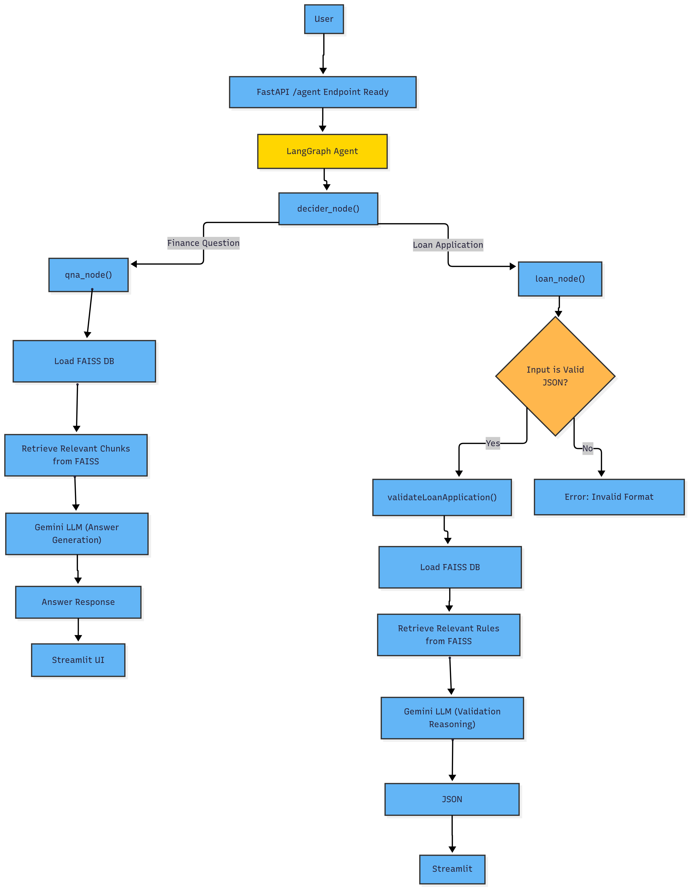
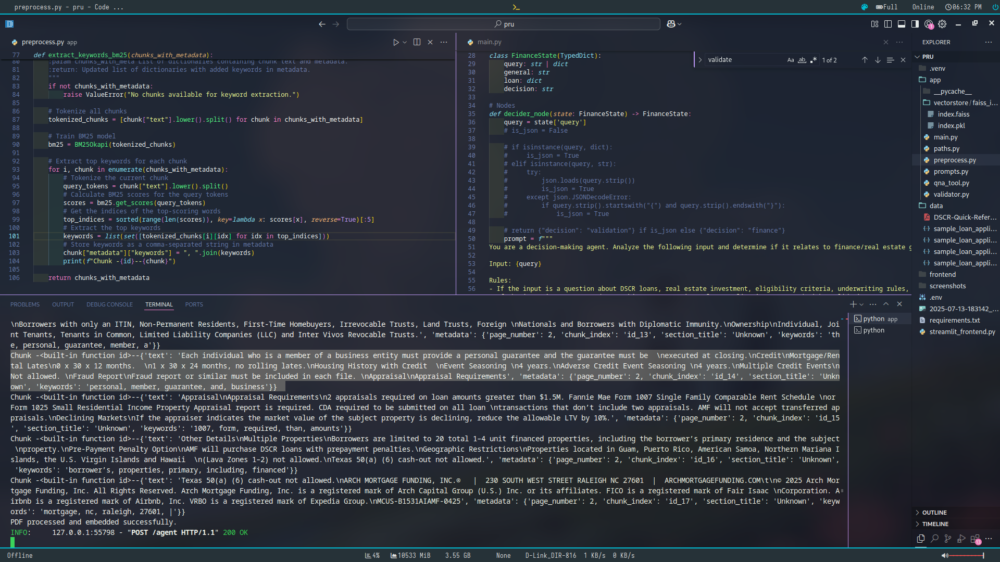
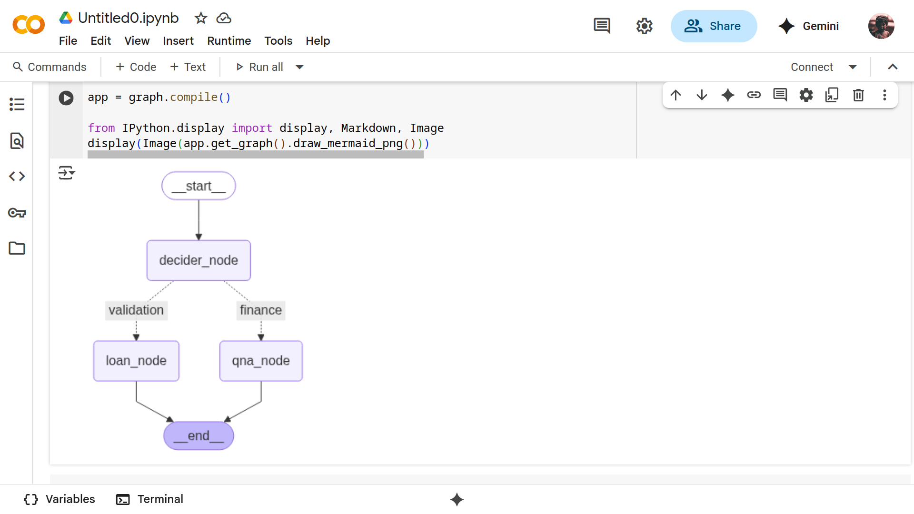
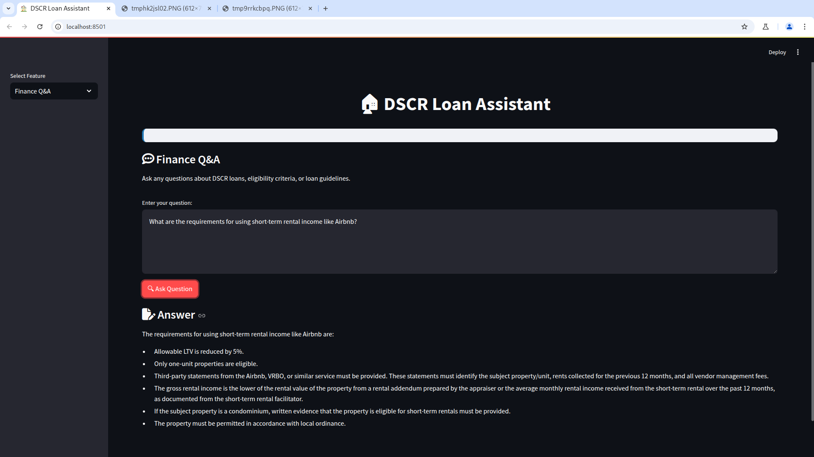
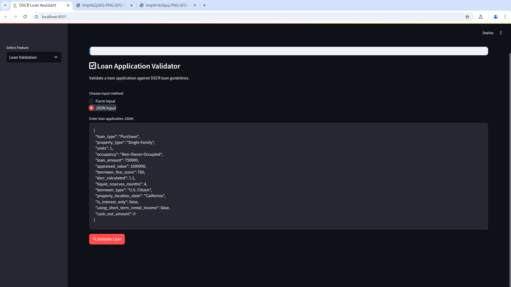
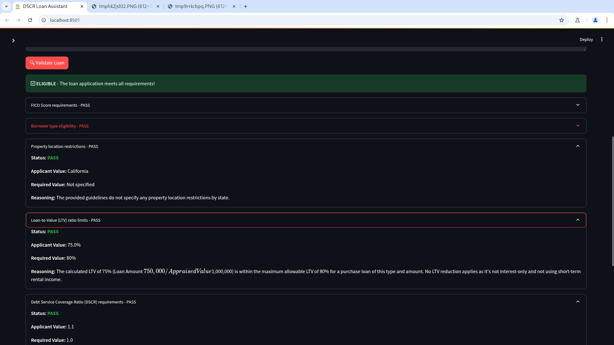
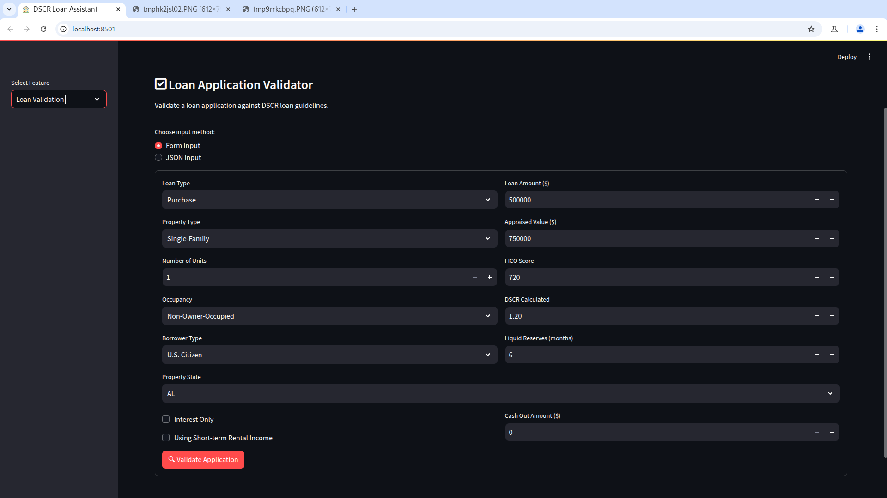

# DSCR Loan Assistant


This project uses a hybrid approach combining **Retrieval-Augmented Generation (RAG)**, **contextual prompting**, and an **agentic workflow** to support both finance-related Q&A and loan validation through a single endpoint `/agent`.

The key to a great quality response is an input of a great quality when it comes to LLMs. I heavily emphasise on the preprocessing and the input part.
**Key techniques used: -**
    1. Keyword extraction from each chunk to be added to the metadata. 
    2. Saving the embeddings locally and the loading it at the start of the server initiation to ensure quick responses.

---
## Architecture


---

## i. How was the PDF processed? What challenges were faced?

The system extracts and prepares content from the DSCR guidelines PDF to support both question answering and loan validation workflows.

### PDF Processing Steps:

1. **PDF Loading**
   - Tested 2 text extraction tools(the results are included in "testing extraction").
     - `PyMuPDF (fitz)` performs good at non-complex layout and digital pages but is quick.
     - `marker-pdf` performs good at complex layout but takes time to extract the text. 
   - I decided to go with `PyMuPDF (fitz)` due to the fact that it was quick and accurate for   the given PDF.

2. **Text Chunking**
   - Used `RecursiveCharacterTextSplitter` to break down long documents into smaller chunks
   - Customized separators like `\n\n`, `\n`, and spaces ensured semantic continuity within each chunk

3. **Metadata Enrichment**
   - Applied **BM25 keyword extraction** to enrich each chunk with metadata
   - Each chunk is tagged with top 5 most relevant keywords to improve retrieval accuracy.
   - 

4. **Embedding & Storage**
   - Converted chunks into vector embeddings using **Sentence Transformers**
   - Stored in a **FAISS vector database** for fast and accurate similarity search

### Challenges Faced:

| Challenge | Description |
|----------|-------------|
| **Complex Document Structure** | The DSCR guidelines contained mixed formatting including vertical text, tables, and multi-column sections — difficult for basic tools like PyMuPDF to parse correctly. |
| **Chunking Strategy** | Ensuring that chunks preserved semantic meaning without breaking mid-sentence required tuning. Solved using recursive character-based splitting and testing various chunk sizes. |
| **Keyword Relevance** | Choosing meaningful keywords per chunk was essential for accurate document retrieval. BM25 proved effective but required post-processing to filter out generic terms. |


---

## ii. What AI approach was used (e.g., RAG, Function Calling, Hybrid)? Why?

The system uses a **hybrid approach** combining **RAG (Retrieval-Augmented Generation)**, **contextual prompting**, and an **agentic workflow** to support both **finance Q&A** and **loan validation** through a single `/agent` endpoint.

### Agentic Workflow

- A **LangGraph agent** dynamically routes input based on content:
  - Natural language questions → `qna_node`
  - JSON-formatted loan applications → `loan_node`



This enables intelligent routing without requiring the user to choose the mode.

### For Finance Q&A: Hybrid RAG (Semantic + Keyword Search)

Used for answering finance-related questions using the DSCR guidelines PDF.

#### Components:
| Technique | Purpose |
|---------|---------|
| **Semantic Search** | Understands intent using SentenceTransformer embeddings |
| **BM25 keyword matching** | Ensures accuracy with exact term matches |

#### Why This Works:
- Balances **meaning-based understanding** (LLM-friendly) with **regulation text precision**
- Reduces hallucination by grounding responses in source documentation
- Supports complex queries while maintaining factual accuracy

### For Loan Validation: Rule-Based Prompting + Business Logic

Used to validate structured loan applications against underwriting rules.

#### Workflow:
1. Input is validated as JSON
2. Relevant context is retrieved from FAISS
3. Google Gemini LLM evaluates the application based on context
4. Structured response includes rule-by-rule evaluation

#### Why This Approach?
- Combines **LLM reasoning** with **audit-ready rule checks**
- Prevents incorrect approvals due to ambiguous or incomplete inputs
- Ensures consistency across loan evaluations

### Why This Hybrid Design Was Chosen

| Component | Benefit |
|----------|---------|
| **Agentic Routing** | Enables a single entry point (`/agent`) to support multiple use cases |
| **Hybrid RAG** | Balances semantic understanding with regulatory precision |
| **Rule-based Post-processing** | Ensures compliance and reduces hallucination |
| **Modular Structure** | Easy to scale or extend with new models or rules |


---

## iii. How were prompts structured to ensure accuracy and prevent hallucination?

To ensure **accuracy**, **consistency**, and to **prevent hallucinations**, I used a **carefully engineered prompt strategy** that leverages both **context grounding** and **structured output formats**.

### Grounded Prompts for Q&A

For finance-related questions, the LLM is explicitly instructed to answer based **only on the provided context**, which includes relevant text chunks retrieved from the DSCR guidelines using FAISS + BM25 hybrid search.

- Avoids open-ended or vague instructions
- Asks for specific facts or interpretations tied directly to the document

Example:
```text
    You are a DSCR Loan Guidelines Expert.

    Your role is to provide accurate, concise, and reliable information based solely on the content of the DSCR Quick Reference Guide. You must not use external knowledge or make assumptions beyond what is explicitly stated in the document.

    If the question cannot be answered using the provided context, respond only with:  
    "The guidelines do not contain this information."

    Guidelines for answering:
    - Only use the information from the context below.
    - Be precise and reference specific values (e.g., percentages, definitions).
    - If multiple conditions apply, explain each clearly.
    - Do not add extra information, opinions, or assumptions.

    Context:
    {context}

    Question:
    {question}

    Answer:
```

This ensures responses are **fact-based**, **traceable**, and aligned with the source documentation.

### Structured Prompts for Loan Validation

For loan application validation, prompts follow a **rule-based format** that:

- Lists all relevant underwriting rules (e.g., FICO score, LTV, property location)
- Includes the **loan data** in JSON format
- Instructs the LLM to return a **strictly formatted JSON response**

Example:
```text
You are a loan underwriter responsible for validating DSCR loan applications. You must validate each loan application against the specific guidelines provided.


LOAN APPLICATION DATA:
{question}

DSCR LOAN GUIDELINES:
{guidelines_context}

VALIDATION INSTRUCTIONS:
1. Check each relevant rule from the guidelines against the application data
2. For each rule, determine the applicant's value, required value, and whether it passes or fails
3. Provide reasoning for each check
4. Determine overall eligibility based on all rule checks


You MUST respond in this exact JSON format:
{{
    "is_eligible": <boolean>,
    "validation_summary": [
        {{
            "rule_checked": "<Description of the rule>",
            "applicant_value": "<Value from the input data>",
            "required_value": "<The required value based on the guidelines>",
            "status": "<'PASS' or 'FAIL'>",
            "reasoning": "<A brief explanation of the check>"
        }}
    ]
}}

VALIDATION RULES TO CHECK:
1. FICO Score requirements
2. Borrower type eligibility
3. Property location restrictions
4. Loan-to-Value (LTV) ratio limits
5. Debt Service Coverage Ratio (DSCR) requirements
6. Liquid reserves requirements
7. Property type and unit count eligibility
8. Loan type compatibility
9. Occupancy type restrictions
10. Any other relevant guidelines from the context

IMPORTANT:
- Only return valid JSON
- Check ALL applicable rules
- Use exact values from the application data
- Extract required values from the guidelines context
- Set "is_eligible" to false if ANY rule fails
- Provide clear reasoning for each check
```

### Preventing Hallucination

To reduce speculative or incorrect outputs:

- **Context Restriction**: Only allowed the LLM to use content from the provided context — no external knowledge
- **Schema Enforcement**: Used strict output formatting and post-processing validation
- **Fallback Logic**: If the LLM fails to generate valid JSON, the system defaults to a structured error message
- **Rule-Based Overrides**: Final eligibility decisions verified by hard business logic after LLM evaluation

### Benefits of This Approach

| Feature | Benefit |
|--------|---------|
| **Context grounding** | Ensures answers are accurate and traceable |
| **Structured prompts** | Guides the model to produce consistent, usable output |
| **Strict schema enforcement** | Prevents malformed or incomplete responses |
| **Validation checks** | Reduces risk of false approvals due to model errors |

This prompt design balances **LLM flexibility** with **control over output structure**, making it ideal for high-stakes financial decision-making.

---

## iv. How was complex validation logic modeled and implemented?

### Validation Logic Overview

The loan validation logic follows a structured, multi-step process to ensure accurate and explainable decisions.

### 1. Input Parsing
- Validates that the input is a well-formed JSON object
- Ensures all required fields are present (e.g., `loan_type`, `borrower_fico_score`, `dscr_calculated`)
- Supports extensibility by allowing extra fields without breaking schema expectations

### 2. Context Retrieval
- Retrieves relevant underwriting rules from the **FAISS vector database**, such as:
  - FICO score thresholds
  - LTV limits
  - Borrower eligibility criteria
  - Geographic restrictions

- Uses this context to construct a detailed prompt for the LLM

### 3. LLM Evaluation
- Sends the loan application along with the retrieved guidelines to the **Google Gemini LLM**
- Prompt instructs the model to evaluate each rule and return a structured response
- Expected format includes:
  - Rule checked
  - Applicant value vs required value
  - Pass/fail status
  - Reasoning behind each decision


### 4. Output Generation
- Aggregates individual rule checks into a **validation summary**
- Final eligibility determined based on whether all rules passed
- Response includes:
  - Overall eligibility status
  - Per-rule breakdown with reasoning
  - Structured JSON output for UI rendering and logging

### Implementation Tools

All core validation logic is encapsulated within:

- **`validator.py`**: Contains the main validation function and helper utilities
- **`validateLoanApplication(data, llm)`**:
  - Orchestrates:
    - Context retrieval from FAISS
    - Prompt generation using templates
    - LLM inference with Gemini
    - Rule-based post-processing

### Key Components Used

| Component | Role |
|----------|------|
| **LangChain Prompt Templates** | Ensures consistent and controlled LLM instruction |
| **Google Gemini LLM** | Provides reasoning over underwriting rules |


This design ensures that even if the LLM makes an incorrect assumption, the final output remains compliant and grounded in the actual DSCR underwriting guidelines.

---

## v. Limitations and Assumptions

### Limitations

- **Single PDF Source**
  - Only one document (`DSCR-Quick-Reference.pdf`) is used as the knowledge base
  - This limits coverage to a specific DSCR product and does not support dynamic or multi-document querying

- **Streamlit Limitations**
  - Streamlit is excellent for POC building but not optimized for production environments


  **No session management**
  **No persistent history between interactions**
  **Lacks user authentication and role-based access control**

### Assumptions

- The provided **DSCR guidelines are complete and accurate**
- The **LLM interprets rules correctly** based on the given context
- All **loan applications are well-structured and complete**
- The **FAISS vector database is built correctly** and reflects current underwriting rules

---

## Path to Production

To productionize this Proof of Concept (PoC), the following enhancements would be made:

### 1. Frontend: Move to React

Replace the Streamlit frontend with a **React-based web application**:

- ✅ Better UI/UX with responsive design
- ✅ Full control over state, routing, and component reuse
- ✅ Easier integration with backend APIs and authentication flows
- ✅ Support for real-time updates and richer interactivity

### 2. Add User Authentication

Implement secure login and permissions:

- 🔐 Role-based access (e.g., Loan Officer, Admin)
- 📋 User-specific history and saved applications

### 3. Enhance Knowledge Base with Web Scraping

To increase accuracy and coverage:

- 🕵️ Scrape websites which can provide relevant information for the query to add to the context
- 🔄 Periodically update FAISS DB with fresh data

### 4. User Experience Enhancements

#### Multi-turn Conversations & Chat History

- Allow users to continue previous conversations
- Retain context across queries
- Display message threads like a chatbot


## Summary

This project demonstrates a robust, modular system for financial decision-making using AI and business logic. It combines:

- **Hybrid RAG** for accurate, grounded question answering
- **Rule-based prompting** for structured loan validation
- **Agentic routing** via LangGraph to unify both modes under one interface

## Instructions 
To run this application: - 
- Make a .env and setup the keys.
- Check the paths in paths.py
- go to the folder `app`
- Run - uvicorn main:app
- In another terminal run - streamlit run streamlit_frontend.py

## Outputs
 
 
 
 